# Abstract

Cyber attacks are one of the biggest threads in this era of digital world. It is very important to combat the network attacks to establish a secure environment for all the users of a network. This project focuses on creating and testing Machine Learning Models over a large dataset of raw network packets to detect network attacks. The dataset used, is created by Cyber Range Lab of UNSW Canberra. The project analyses the performance of different ML models like XGBoost, Random Forest, Decision Tree and Gradient Boost over the dataset. The dataset has been preprocessed using techniques like Dimension Reduction, Feature Scaling. The performance, in terms of Acuracy and F1 score, is studied for each model and the inferences like best working model are derived.

# 1. Introduction
The occurrence of cyber security incidents have proliferated in recent years. Almost every year, one or two major information security incidents attract the attention of the world. Numerous studies have already been conducted in the field of cyber security utilizing data mining technologies. Using the UNSW-NB15 Dataset [@7348942], we will detect that if the network is under attack. This dataset is created by Cyber Range Lab of UNSW Canberra. It is widely used and is named as UNSW-NB15 dataset. The raw network packets of the UNSW-NB 15 dataset were created by the IXIA PerfectStorm tool. This dataset has a hybrid of the real modern normal and the contemporary synthesized attack activities of the network traffic.

It has nine types of attacks, namely, Fuzzers, Analysis, Backdoors, DoS, Exploits, Generic, Reconnaissance, Shellcode and Worms unlike other widely available dataset like KDD-99 dataset which has only four attack types DOS, R2L, U2R, and PROBE. The attack distribution data of UNSW-NB15 is shown in Figure 1.1  

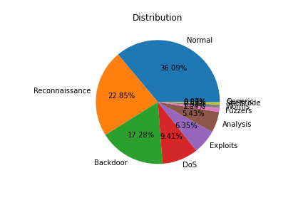

# 2. Literature Review

Many datasets have been used for Intrusion detection system like KDD’99. According to A. Divekar et al, “As with KDD-99, certain parameters were found unnecessary. A reduced set of 20 features found by Mean Decrease Impurity was used in this paper.”[@Divekar2018BenchmarkingDF]. Tavallaee et al. [@Tavallaee2009ADA], while proposing an improved NSL-KDD, provided a comprehensive description of the KDD CUP 99's idiosyncrasies”.Tavallaee et al. [@Tavallaee2009ADA] developed NSL-KDD to rectify KDD-99 and overcome its drawbacks. However, it had some drawbacks like non representation of low footprint attacks[@7348942]. A. Divekar et al, have compared and the datasets by applying preprocessing and feature Selection and found that uNSW-NB15 was found to be a modern substitute to  NSL-KDD and KDD CUP 99 dataset.[@Divekar2018BenchmarkingDF]  
A svm based model was implemented by D. Jing and H. Chen.According to the authors”the performance of our method is evaluated through accuracy, detection rate and false positive rate. Compared with other methods, the superiority of the proposed SVM method is shown by the experimental results.”[@Jing2019SVMBN].
A multi-layer perceptron feed-forward artificial neural network with a single hidden layer was proposed by M. Al-Zewairi et al[@AlZewairi2017ExperimentalEO]. According to the authors, “The evaluation results demonstrate that the proposed classifier outperforms other models in the literature with 98.99% accuracy and 0.56% false alarm rate on unseen data.”[@AlZewairi2017ExperimentalEO]The decision trees was one of the models that was compared with this Artificial neural network.

# 3. Exploratory Data Analysis

For our work, the UNSW-NB15 dataset contains 257,673 data instances with 49 features. The total classes of this dataset are 10 classes: one is for a *normal* network data (93 000 instances) and nine classes of anomalous network data (attacks classes).  The attacks involved were *backdoor* (2,329 instances), *analysis* (2,677 instances), *fuzzers* (24,246 instances), *shellcode* (1 511), *reconnaissance* (13,987 instances), *exploits* (44,525 instances), *DoS* (16,353 instances), *worms* (174 instances), and *generic* (58,871 instances). 
The data distribution data of UNSW-NB15 is shown in Figure 1.1.  
After dropping some highly correlated features to avoid redundancy, we have chosen and analysed 20 of them. We perfomed 3 kinds of exploratory data analysis on the UNSW-NB15 dataset, namely countplot or barplot for all categorial or columns with small number of unique values, plot PDF (probability density function) for numerical features, and Correlation of the features and its heatmap.  
In this data set, there are total 9 attack categories of attack and normal is non-attack. The data is highly imbalanced and have lots of non-attack than attacks.
The most occured attack data categories are "*Reconnaissance*", "*Backdoor*", "*DoS*", "*Exploits*" and "*Analysis*". 
In the **protocol** category, most of the values are consists of udp and tcp. For attacks count of udp is lot higher. The bar plot is shown in Figure 3.1.

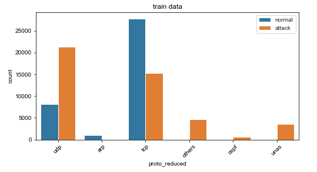

In **attack** data "dns" is present higher than any other values. There are few no of others and http also. 
In the **state** category we found the imbalance, there are lots of int state for attacks.  
For numerical features, we plot PDF. For better visualization, we also used log scale. 
There are some results worth pointing out. **dload**: destination bits per second, in Figure 3.2.1 and 3.2.2, for attack data all the values are very close to 0. 
For normal data they are distributed all over, has values close to 0 and also very large values. **sbytes**: source to destination bytes, most of normal category values are close to 0. Attack categories has most of its values around 5 in log1p graph. 
The spread of values is wider in attack compared to normal.  

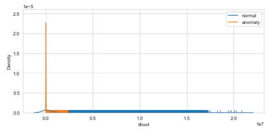

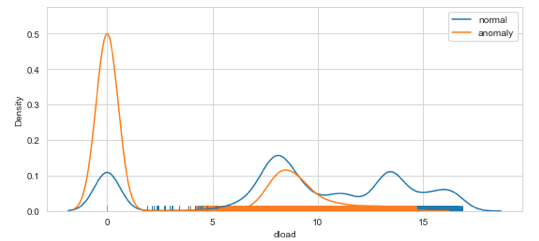
Figure 3.2.2 shows dload in log scale.

To get correlation values for all the features, we plot heatmap of correaltion shown in Figure 3.3 for better visualization. The most correlated features are: sbytes and sloss, sbytes and sloss, swin and dwin. 
These features are having very high correlation between them more than 95%.
Although some features have high correlation between them, some of them is because they share same values, for instance, swin and dwin have correlation values is 99% between them. 
Even though these 2 columns are numerical but most of their values are only 0 and 255.

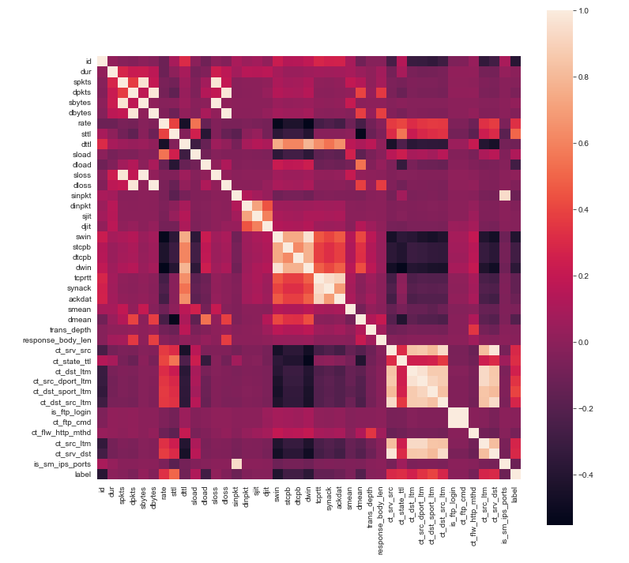

# 4. Data Preparation
Large data that is to be studied and worked upon is often raw and needs cleaning. Data is cleaned for errors like missing values, incorrect values, unnecessary and duplicate data etc. Therefore, data cleaning is the first step that is performed before working ahead with any dataset. In this project, following are the basic data preparation steps that have been performed:

1. Dropping unnecessary columns: The columns that add no information to the dataset are dropped so that number of features to work with are reduced.

2. Dealing with Missing Values: Generally, the dataset contains some missing values which need to be dealt with attentively. There are different ways to deal with a missing value:
 	2.1 Drop the missing value record(row) or feature(column)
 	2.2 Replace missing value with appropriate mean/mode/median value of the feature(column)

In this project, since input dataset did not contain any missing values for numerical data, this step is not performed. 

3. Incorrect values: There could some invalid entries into a feature that are not of the expected datatype of that feature. These values need to be corrected. In this project, few columns like "is_ftp_login" and "is_sm_ips_ports" that expected binary input contained non binary value. This is corrected to get non-erroneous results. 

# 5. Data Pre-Processing
Data pre-preocessing is performed in order to generate a dataset that aids Machine Learning to predict more accurate results. Following data preprocessing steps have been performed in this project:

## 5.1 Encoding 
Dataset generally contains columns that hold categorical values. This is because categorical values are more decriptive that numerical values. But ML models cannot work with any non-numerical values. So, prior to feed data to Machine Learning model, encoding is performed. There are two types of encodings that are ususally performed:

1. Label Encoding: It is a simple technique to assign numbers to different categorical values. But it is generally misinterpreted by algorithms as having some sort of hierarchy/order.

2. One-Hot Encoding: It eliminates the hierarchy/order issues. But it adds more columns(features) to the data set which may contribute to overfitting.

In this project, both type of encoders were tested for. It is then infered from the results, that one-hot encoding is leading to increase in the feature numbers from 45 to above 200. So, label encoder is the best choice. It is used on the categorical columns like "dtype","proto", "stype".

## 5.2 Data Normalization

Data normalization is done to make the data set cohesive and similar across all the fields and columns.In the UNSW-NB15 dataset, if the data normalization is not done it will lead to the suppression of  the effectiveness of an important equally important attribute(on a lower scale because of other attributes having values on a larger scale.

### 5.2.1 MinMax normalization
The min max normalization is used to transform features to be on a similar scale.
It reduced the values to the range of [0,1]
 The new point is calculated as :

  *X_new = (X - X_min)/(X_max - X_min)* 
 
Geometrically speaking, transformation squishes the n-dimensional data into an n-dimensional unit hypercube.
The Description of the features after applying MinMax scaling:

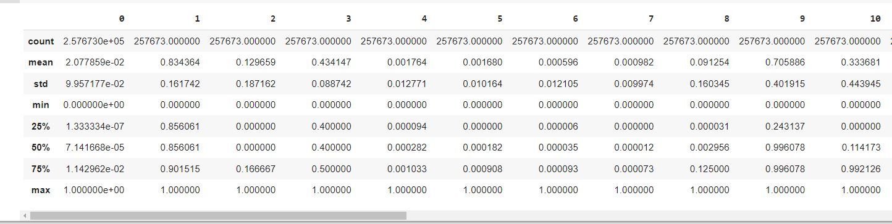
Figure 5.2.1 shows the description of top 10 features after applying MinMax scaler.

### 5.2.2 Z-Score Normalization

Standardization or Z-Score Normalization is the transformation of features by subtracting from mean and dividing by standard deviation. This is often called as Z-score.
The new data points are added as :

 *X_new = (X - mean)/Std* 

Geometrically speaking, it translates the data to the mean vector of original data to the origin and squishes or expands the points if std is 1 respectively.

Standardization does not get affected by outliers because there is no predefined range of transformed features.

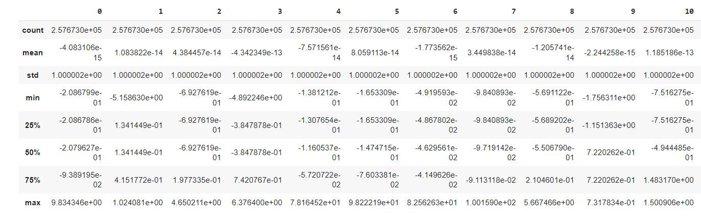
Figure 5.2.2 shows the description of top 10 features after applying standard scaler.

During the preprocessing steps, the dataset was found to be highly skewed and had differnet distributions with differnet features. Hence, only Min Max scaler is applied to the dataset.
In UNSW-NB15 dataset, the outliers play an important role. The outliers are the datapoints, where the algorithm can predict anomaly. In later sections, We apply different techniques for dimencionality reductions and compare the accuracy and F1-score of the models on the train and test set. 

# 6. Dimensionality reduction:
The dataset has 45 features. After dropping a few, the dataset was reduceded to 43 features.The puropose of dimnesionality reduction is to reduce the storage space and reduce the computational time for the algorithm. It also helps in the removal of redundant features.

## 6.1 Correlation Analysis 
Correlation feature selection is used for eliminating or dropping columns which have high correlation amongst each other. We can take only one of the columns/features amongst the highly correlated features with each other. These features doesnot worsen the model but doesnot add any new information either. We have removed columns that we were highly correlated with each other above 95%.
The columns dropped were:
 
*'sbytes', 'dbytes', 'sloss', 'dloss', 'dwin', 'ct_src_dport_ltm', 'ct_dst_src_ltm', 'ct_ftp_cmd', 'ct_srv_dst'*

The features on the dataset reduced to 33.
Figure 3.3 shows the complete visualization of correlation values.

## 6.2 Principal Component Analysis 
Principal Component Analysis, or PCA, is a dimensionality-reduction method that is often used to reduce the dimensionality of large data sets, by transforming a large set of variables into a smaller one that still contains most of the information in the large set. But this dimensionality reduction technique may reduce the accuracy of any model at quite a high rate. The principal component analysis algorithm was applied on the dataset considering the to capture the minimum variance of 99%. After applying PCA, the number of features that are responsible for the detection of 99% of variance has been reduced to 29 from 42 columns.
Figure shows the clustering of the PCA.

# 7. Datasets
In this paper we are going to compare different preprocessing techniques and their effect on different tree based ML models.
Datasets prepared to apply to the model:

1. Dataset without any preprocessing(X):
No preprocessing techniques like normalization, standardization, any tecnhoniques for dimensionality reduction.
2. Dataset after applying MinMax scaler(X_mm)
This dataset was prepared by only applying Min Max scaling to the dataset.
3. Dataset after applying MinMax scaler and correlation analysis(X_mm_corr)
This dataset was prepared by only applying Min Max and correlation analysis.
4. Dataset after applying Principle component analysis(X_pca)
This dataset was prepared by applying standard scaler and PCA. No Min max scaler was applied on the dataset.PCA works with the component with high variance, hence appication of MinMax is not neccessary in this case.

# 8. Data Modeling

## 8.1 Techniques Applied

## 8.1.1 GridSearchCV
In GridSearchCV approach, machine learning model is evaluated for a range of hyperparameter values. This approach is called GridSearchCV, because it searches for best set of hyperparameters from a grid of hyperparameters values.
For example, if we want to set one hyperparameter 'max_depth' of Decision trees classifer model, with different set of values. The gridsearch technique will construct many versions of the model with all possible combinations of hyerparameters, and will return the best one. This is done so that algorithm can learn or identify the pattern in data efficiently and provide a good performing model.
The only drawback of this apporach is it becomes computationally expensive. In our method, we have taken common tree hyper parameters along with model specific parameter to train the model and get the best results. The cross fold count was taken as 3. 
## 8.1.2 Model comparison paramters
A confusion matrix presents the ways in which a classification model becomes confused while making predictions.

We have compared on the basis of accuracy and F1-score. We have considered F1-score, because there is a slight imbalance in the classes of the target features.

1. Accuracy :

*Accuracy =  TP+TN/(TP+TN+FP+FN)*

The higher the accuracy, the better is the model. However, we should consider the accuracy of the train and test set both to check if the model is overfitting.

2. F1-Score:

 *F1-score = 2 X (TP)/(2TP+FN+FP)* 

The higher the F1-score, the better the model.

## 8.2.1 Models

Machine models needs to be trained on the network packets from the dataset to allow them to detect network attacks.There are different machine learning models available, but for this project, Only tree based models were chosen. The following four are considered:

1. XGBoost

2. GB Gradient

3. Decision Tree

4. Random Forest

## 8.2.1.1 XGBoost

XGBoost, which stands for Extreme Gradient Boosting, is a scalable, distributed gradient-boosted decision tree (GBDT) machine learning library. It provides parallel tree boosting and is the leading machine learning library for regression, classification.
Extreme Gradient Boosting (xgboost) is similar to the gradient boosting framework but more efficient. It has both linear model solver and tree learning algorithms. So, what makes it fast is its capacity to do parallel computation on a single machine.
When using boosting techniques all instances in the dataset are assigned a score that tells how difficult to classify they are.
The XGboost model was applied to the different preprocessed dataset. Figure shows that the test accuracy is above 90% for the cases.

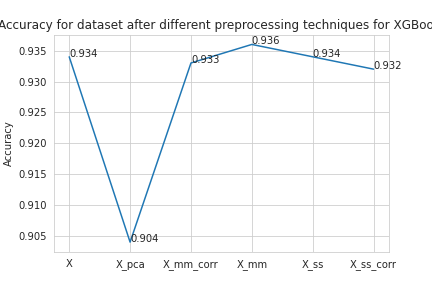
Figure 8.2.1.1.1 shows the accuracy plots for different preprocessed datasets.

Checking only the accuracy of the model on the test set is not enough, we would need to check the model accuracy on both test and train set to check if out model was overfitting.

Here we can the best performing model is the models with the minmax scaler and the correlation analysis applied. The model is slightly overfitting but, it is better performing model than the other three.
The F1-score is also high for this model. Below is the image for F1-scores of all the datasets and confusion matrix for the model trained using dataset preprocessed with Minmax scaler and correlation analysis.
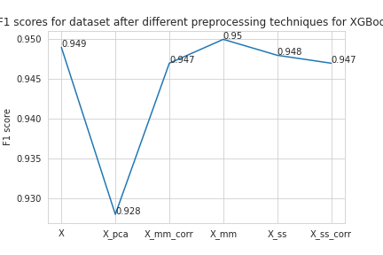

Figure 8.2.1.1.2 shows the F1 scores of the models build from different preprocessed datasets.
From the table above we can see when the model was applied to without preprocessed dataset, it was overfitting. It is because the features are not at the same scale and hence one features might have dominating effect on the other important features in this tree based model. Hence the accuracy on train set is high and accuracy on the test set is low.
The dataset with minmax scaler applied performs better than the dataset with no preprocessing. However, we can see the model is still slightly over fitting.
The dataset with minmax scaler applied perform equailvalent to the dataset with minmax scaler and correaltion applied.
The datset where pca is worse, the model is overfitting the dataset on train, hence the accuracy at the test data is low. 

## 8.2.1.2 Gradient Boost
Gradient boosting is a machine learning technique used in regression and classification tasks, among others. It gives a prediction model in the form of an ensemble of weak prediction models, which are typically decision trees. When a decision tree is the weak learner, the resulting algorithm is called gradient-boosted trees. A gradient-boosted trees model is built in a stage-wise fashion as in other boosting methods, but it generalizes the other methods by allowing optimization of an arbitrary differentiable loss function. All the trees are connected in series and each tree tries to minimise the error of the previous tree. Due to this sequential connection, the gradient boost algorithm is usually slow to learn, but also highly accurate.

Figure 8.2.2 shows a good F1 score for the gradient descent algorithm. Also the model classifies in the test data above 90%. Although it takes time for the fitting due to its sequential connection.

## 8.3 Decision Tree

A tree can be “learned” by splitting the source set into subsets based on an attribute value test. This process is repeated on each derived subset in a recursive manner called recursive partitioning. The recursion is completed when the subset at a node all has the same value of the target variable, or when splitting no longer adds value to the predictions. The construction of decision tree classifier does not require any domain knowledge or parameter setting, and therefore is appropriate for exploratory knowledge discovery. 
The Decision Tree model was applied to the different preprocessed datasets and the following results were observed.

. 
Figure 8.3.1 shows the accuracy of the decision trees on the different preprocessed dataset. 
It can be observed that with Standard Scaling preprocessing technique, the accuracy of DT is maximum, and with PCA, it is lowest.

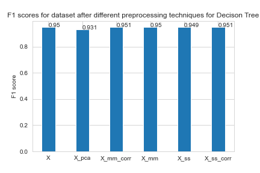. 
Figure 8.3.2 shows the F1-score of the decision trees on the different preprocessed dataset. 
It can be observed that with Standard Scaling preprocessing technique, F1 of DT is maximum, and with PCA, it is lowest.

The accuracy and F1 scores are high for the dataset with standard scaler on the model. Model fitted with dataset with Minmax scaling has similar performance to the model fitted with dataset that has MinMax scaling applied and feature pruning on basis of correlation.

## 8.4 Random Forest
Random Forest is a classification algorithm that is a combination of many decision trees. It is a better classifier than a decision tree since it leverages the advantages of DT and overcomes its shortcomings. Therefore, the feature of the Random forest model includes simplicity and good accuracy.
One of the best ways to analyze the performance of a Machine Learning model is by studying its accuracy and F1 score. The accuracy and F1 score of the Random Model as a classifier is computed and plotted for different preprocessing techniques. It is observed that both accuracy (Figure 7.4.1) and F1 score (Figure 7.4.2) given by Random Forest are better than most of the other models that the testing is performed. This can be inferred from this that Random Forest predicts more accurate results here. 

. 
Figure 8.4.1 shows the Accuracy plot of the Random Forest on the different preprocessed dataset when Cross Validation is not applied to the model. 

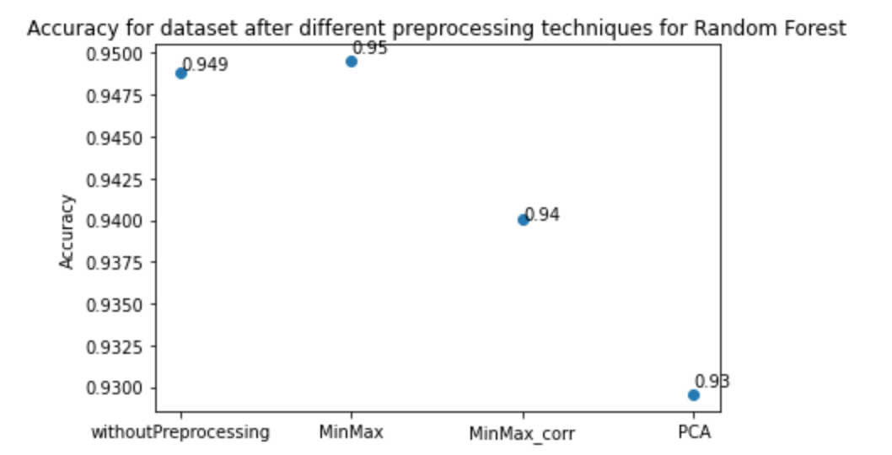. 
Figure 8.4.2 shows the Accuracy plot of the Random Forest on the different preprocessed dataset when Cross Validation is applied to the model. 

It can be observed accuracy of RF is maximum for three preprocessing techniques i.e MinMax scaling with correlation, MinMax Scaling, and Standard Scaling. It is the lowest with PCA. 

. 
Figure 8.4.3 shows the F1-score of the Random Forest on the different preprocessed dataset when Cross Validation is not applied to the model. 

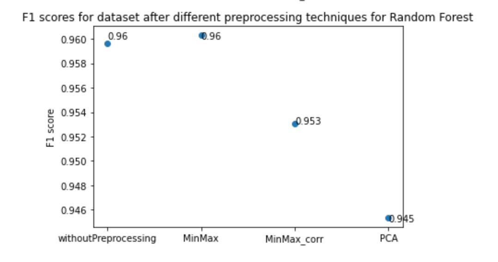. 
Figure 8.4.4 shows the F1-score of the Random Forest on the different preprocessed dataset when Cross Validation is applied to the model. 

It can be observed that with MinMax preprocessing technique, F1 of RF is maximum, and with PCA, it is lowest.

# 9. Comparisons : leaving this part now

## 9.1 Without Processing the dataset
The data modeling was done for the data without any processing which gave the following results shown in Figure 8.1.
 

For XG Boost accuracy was 95%, for Gradient boost it dropped to 93.3% further for Decision tree it was around 93.6% and lastly for Random forest the accuracy was 93.4%.

## 9.2 After applying Min-Max Scaler algorithm
The data modeling was done for the dataset which gave the following results shown in Figure 8.2.
 

For XG Boost accuracy was 95.1%, for Gradient boost it dropped to 93.3% further for Decision tree it was around 93.7% and lastly for Random forest the accuracy was 93.6%.

## 9.3 After applying Min-Max Scaler with Correlation
The data modeling was done for the dataset which gave the following results shown in Figure 8.3.
 
 

For XG Boost accuracy was 95.1%, for Gradient boost it dropped to 93.3% further for Decision tree it was around 93.7% and lastly for Random forest the accuracy was 93.3%.

## 9.4 After applying Standard Scaler with PCA

 
For XG Boost accuracy was 95%, for Gradient boost it dropped to 93.3% further for Decision tree it was around 93.6% and lastly for Random forest the accuracy was 93.2%.  
The standard scaler processing proved to be the most accurate for all the models with accuracy of 95.1%, 93.3%, 93.8% and 93.4% for XG Boost, Gradient Boost, Decision tree and Random Forest respectively. The main reason is Standard Scaler removes the mean and scales the data to unit variance. It also shrinks the range of feature.

# Conclusions
Get the best model and say ... SOME INFERNECES.

# References
