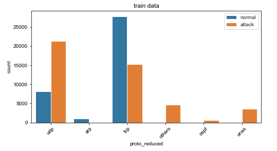
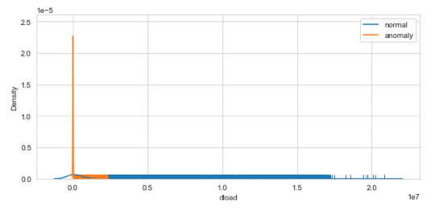
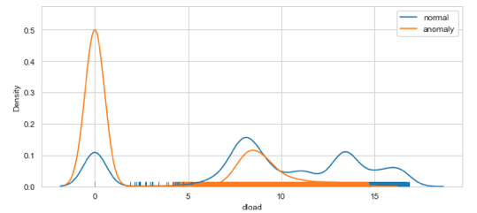
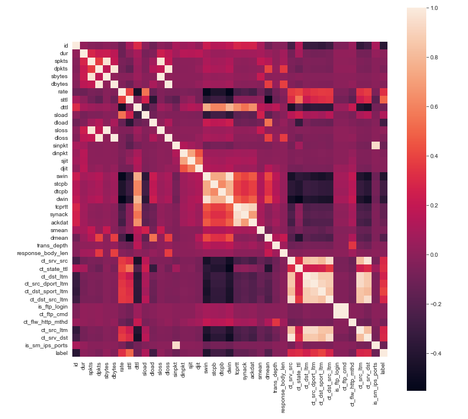

# Abstract

Cyber attacks are one of the biggest threads in this era of digital world. It is very important to combat the network attacks to establish a secure environment for all the users of a network. This project focuses on creating and testing Machine Learning Models over a large dataset of raw network packets to detect network attacks. The dataset used, is created by Cyber Range Lab of UNSW Canberra. The project analyses the performance of different ML models like XGBoost, Random Forest, etc. over the dataset that has been preprocessed using techniques like Dimension Reduction, MinMax Scaling etc. The performance, in terms if Acuracy and F1 score, is studied for each model and the inferences like best working model are derived.

# Introduction
The occurrence of cyber security incidents have proliferated in recent years. Almost every year, one or two major information security incidents attract the attention of the world. Numerous studies have already been conducted in the field of cyber security utilizing data mining technologies. Using the UNSW-NB15 Dataset [@7348942], we will predict the network attack that is happening over the network. This dataset has nine types of attacks, namely, Fuzzers, Analysis, Backdoors, DoS, Exploits, Generic, Reconnaissance, Shellcode and Worms unlike other dataset like KDD-99 dataset which has only four attack types DOS, R2L, U2R, and PROBE. The attack distribution data of UNSW-NB15 is shown in Figure 1.  

# Exploratory Data Analysis

For our work, the UNSW-NB15 dataset contains 257,673 data instances with 49 features. 
The total classes of this dataset are 10 classes: one is for a *normal* network data (93 000 instances) and nine classes of anomalous network data (attacks classes). 
The attacks involved were *backdoor* (2,329 instances), *analysis* (2,677 instances), *fuzzers* (24,246 instances), 
*shellcode* (1 511), *reconnaissance* (13,987 instances), *exploits* (44,525 instances), *DoS* (16,353 instances), 
*worms* (174 instances), and *generic* (58,871 instances). 
The data distribution data of UNSW-NB15 as in Figure 1.  
We perfomed 3 kinds of exploratory data analysis on the UNSW-NB15 dataset, 
namely countplot or barplot for all categorial or columns with small number of unique values, plot PDF for numerical features, and Correlation of the features and its heatmap.  
In this data set, there are total 9 attack categories of attack and normal is non-attack. The data is highly imbalanced and have lots of non-attack than attacks.
The most occured attack data categories are "*Reconnaissance*", "*Backdoor*", "*DoS*", "*Exploits*" and "*Analysis*". 
In the **protocol** category, most of the values are consists of udp and tcp. For attacks count of udp is lot higher. The bar plot is shown in Figure 2.

In **attack** data "dns" is present higher than any other values. There are few no of others and http also. 
In the **state** category we found the imbalce there are lots of int state for attacks.  
For numerical features, we plot PDF. For better visualization, we also used log scale. 
There are some results worth pointing out. **dload**: destination bits per second, in Figure 3-1 and 3-2, for attack data all the values are very close to 0. 
For normal data they are distributed all over, has values close to 0 and also very large values. **sbytes**: source to destination bytes, most of normal category values are close to 0. Attack categories has most of its values around 5 in log1p graph. 
The spread of values is wider in attack compared to normal.  

To get correlation values for all the features, we plot heatmap of correaltion shown in Figure 4 for better visualization. Most correlated features are: sbytes and sloss, sbytes and sloss, swin and dwin. 
These features are having very high correlation between them more 95%.
Although some features have high correlation between them, some of them is because they share same values, for instance, swin and dwin have correlation values is 99% between them. 
Even though these 2 columns are numerical but most of their values are only 0 and 255.

# Data Pre-Processing
Large data that is to be studied and worked upon is often raw and needs pre-processing. There are two steps in this:
1. Data cleaning and preparation 
2. Data pre-processing

## Data Preparation
Data needs to be cleaned for errors like missing values, incorrect values, unnecessary and duplicate data etc. Therefore, data cleaning is the first step that is performed before working ahead with any dataset. In this project, following are the basic data preparation steps that have been performed:
1. Dropping unnecessary columns: The columns that add no information to the dataset are dropped so that number of features to work with are reduced.

2. Dealing with Missing Values: Generally, the dataset contains some missing values which need to be dealt with attentively. There are different ways to deal with a missing value:
	2.1 Drop the missing value record(row) or feature(column)
	2.2 Replace missing value with appropriate mean/mode/median value of the feature(column)
In this project, since input dataset did not contain any missing values, this step is not performed. 

3. Incorrect values: There could some invalid entries into a feature that are not of the expected datatype of that feature. These values need to be corrected. In this project, few columns like "is_ftp_login" and "is_sm_ips_ports" that expected binary input contained non binary value. This is corrected to get non-erroneous results. 

## Data Pre-Processing
Data pre-preocessing is performaned in order to generate a dataset that aids Machine Learning to predict more accurate results. Following data preprocessing steps have been performed in this project:

1. Encoding: 
Dataset generally contains columns that hold categorical values. This is because categorical values are more decriptive that numerical values. But ML models cannot work with any non-numerical values. So, prior to feed data to Machine Learning model, encoding is performed. There are two types of encodings that are ususally performed:
1. Label Encoding
	Pros: 
		- Simple technique
		- Assigns numbers to different categorical values
	Cons:
		- Misinterpreted by algorithms as having some sort of hierarchy/order
2. One-Hot Encoding
	Pros:
		- Eliminates the hierarchy/order issues 
	Cons:
		- Adds more columns(features) to the data set which may contribute to overfitting

In this project, both type of encoders were tested for. It is then infered from the results, that one-hot encoding is leading to increase in the feature numbers from 45 to above 200. So, label encoder is the best choice. It is used on the categorical columns like "dtype","proto", "stype".

2. Data Scaling:
4.2 Data Normalization::

Data normalization is done to make the data set cohesive and similar across all the fields and columns.In the UNSW-NB15 dataset, if the data normalization is not done it will lead to the suppression of  the effectiveness of an important equally important attribute(on a lower scale because of other attributes having values on a larger scale.
4.2.1: MinMax normalization :
The min max normalization is used to transform features to be on a similar scale.
It reduced the values to the range of [0,1]
 The new point is calculated as :
X_new = (X - X_min)/(X_max - X_min)
Geometrically speaking, transformation squishes the n-dimensional data into an n-dimensional unit hypercube.

The Feature set after Applying MinMax scaler.

Figure : here
4.2.2: Z-Score Normalization:

Standardization or Z-Score Normalization is the transformation of features by subtracting from mean and dividing by standard deviation. This is often called as Z-score.
The new data points are added as :
X_new = (X - mean)/Std

Geometrically speaking, it translates the data to the mean vector of original data to the origin and squishes or expands the points if std is 1 respectively.

Standardization does not get affected by outliers because there is no predefined range of transformed features.
Figure here:

In UNSW-NB15 dataset, the outliers play an important role. The outliers are the datapoints, where the algorithm can predict anomaly. In later sections, we will compare the effects of both kinds of Normalization on the tree based algorithms, with respect to accuracy and F1 score.

3. Dimension Reduction 

# Data Modeling
Machine models needs to be trained on the network packets from the dataset to allow them to detect network attacks. There are different machine learning models available, but for this project, the following four are considered:
1. XGBoost
2. GB Gradient
3. Decision Tree
4. Random Forest

## XGBoost
6.1:XGBoost:
XGBoost, which stands for Extreme Gradient Boosting, is a scalable, distributed gradient-boosted decision tree (GBDT) machine learning library. It provides parallel tree boosting and is the leading machine learning library for regression, classification.
Extreme Gradient Boosting (xgboost) is similar to the gradient boosting framework but more efficient. It has both linear model solver and tree learning algorithms. So, what makes it fast is its capacity to do parallel computation on a single machine.
When using boosting techniques all instances in the dataset are assigned a score that tells how difficult to classify they are.
The XGboost model was applied to the different preprocessed dataset. The accuracy of the XGBoost is high when compared to other algorithms. Figure shows that the test accuracy is above 90% for the cases.

Figure :
!

Figure shows a good F1 -score, that the model classifies the classes in  test data above 90% accurately.

Here are the different ROC scores on the different preprocessed data :

Figure:

Area under the curve for ROC is high, if we consider the threshold as 50%. Figure indicates that the models is performing well fo both the classes ie, 0 and 1

## GBGradient
RandomForest/

## Decision Tree

## Random Forest
Random Forest is a classification algorithm is combination of many decision trees. It is a better classifier than decision tree since it leverages the advantages of DT and overcomes its shortcomings. Therefore, the feature of Random forest model include simplicity and good accuracy.

One of the best ways to analysis the performance of a Machine Learning model is studying its ROC curve. In this project, ROC curves for Random Forest was studied with different preprocessing techniques and following were the observations:

# Comparisons

# Example Analysis

# Conclusions

# References
