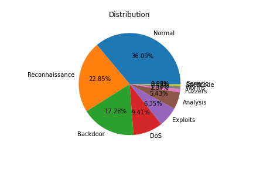
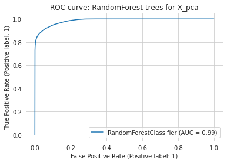
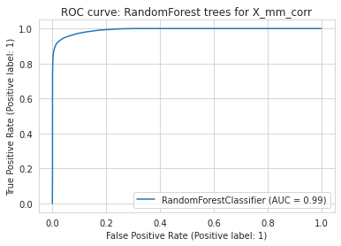
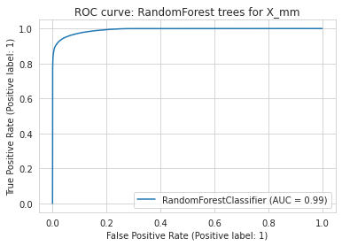
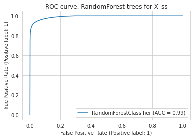
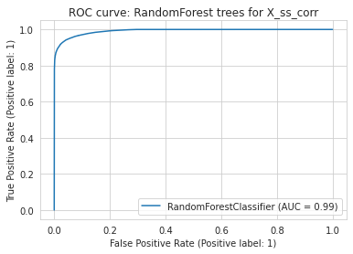

# Abstract

Cyber attacks are one of the biggest threads in this era of digital world. It is very important to combat the network attacks to establish a secure environment for all the users of a network. This project focuses on creating and testing Machine Learning Models over a large dataset of raw network packets to detect network attacks. The dataset used, is created by Cyber Range Lab of UNSW Canberra. The project analyses the performance of different ML models like XGBoost, Random Forest, etc. over the dataset that has been preprocessed using techniques like Dimension Reduction, MinMax Scaling etc. The performance, in terms if Acuracy and F1 score, is studied for each model and the inferences like best working model are derived.

# Introduction
The occurrence of cyber security incidents have proliferated in recent years. Almost every year, one or two major information security incidents attract the attention of the world. Numerous studies have already been conducted in the field of cyber security utilizing data mining technologies. Using the UNSW-NB15 Dataset [@7348942], we will predict the network attack that is happening over the network. This dataset has nine types of attacks, namely, Fuzzers, Analysis, Backdoors, DoS, Exploits, Generic, Reconnaissance, Shellcode and Worms unlike other dataset like KDD-99 dataset which has only four attack types DOS, R2L, U2R, and PROBE. The attack distribution data of UNSW-NB15 is shown in Figure 1.  

# Exploratory Data Analysis

# Data Pre-Processing
Large data that is to be studied and worked upon is often raw and needs pre-processing. There are two steps in this:
1. Data cleaning and preparation 
2. Data pre-processing

## Data Preparation
Data needs to be cleaned for errors like missing values, incorrect values, unnecessary and duplicate data etc. Therefore, data cleaning is the first step that is performed before working ahead with any dataset. In this project, following are the basic data preparation steps that have been performed:
1. Dropping unnecessary columns: The columns that add no information to the dataset are dropped so that number of features to work with are reduced.

2. Dealing with Missing Values: Generally, the dataset contains some missing values which need to be dealt with attentively. There are different ways to deal with a missing value:
	2.1 Drop the missing value record(row) or feature(column)
	2.2 Replace missing value with appropriate mean/mode/median value of the feature(column)
In this project, since input dataset did not contain any missing values, this step is not performed. 

3. Incorrect values: There could some invalid entries into a feature that are not of the expected datatype of that feature. These values need to be corrected. In this project, few columns like "is_ftp_login" and "is_sm_ips_ports" that expected binary input contained non binary value. This is corrected to get non-erroneous results. 

## Data Pre-Processing
Data pre-preocessing is performaned in order to generate a dataset that aids Machine Learning to predict more accurate results. Following data preprocessing steps have been performed in this project:

1. Encoding: 
Dataset generally contains columns that hold categorical values. This is because categorical values are more decriptive that numerical values. But ML models cannot work with any non-numerical values. So, prior to feed data to Machine Learning model, encoding is performed. There are two types of encodings that are ususally performed:
1. Label Encoding
	Pros: 
		- Simple technique
		- Assigns numbers to different categorical values
	Cons:
		- Misinterpreted by algorithms as having some sort of hierarchy/order
2. One-Hot Encoding
	Pros:
		- Eliminates the hierarchy/order issues 
	Cons:
		- Adds more columns(features) to the data set which may contribute to overfitting

In this project, both type of encoders were tested for. It is then infered from the results, that one-hot encoding is leading to increase in the feature numbers from 45 to above 200. So, label encoder is the best choice. It is used on the categorical columns like "dtype","proto", "stype".

2. Data Scaling

3. Dimension Reduction 

# Data Modeling
Machine models needs to be trained on the network packets from the dataset to allow them to detect network attacks. There are different machine learning models available, but for this project, the following four are considered:
1. XGBoost
2. GB Gradient
3. Decision Tree
4. Random Forest

## XGBoost

## GBGradient
RandomForest/

## Decision Tree

## Random Forest
Random Forest is a classification algorithm is combination of many decision trees. It is a better classifier than decision tree since it leverages the advantages of DT and overcomes its shortcomings. Therefore, the feature of Random forest model include simplicity and good accuracy.

One of the best ways to analysis the performance of a Machine Learning model is studying its ROC curve. In this project, ROC curves for Random Forest was studied with different preprocessing techniques and following were the observations:

# Comparisons

# Example Analysis

# Conclusions

# References
